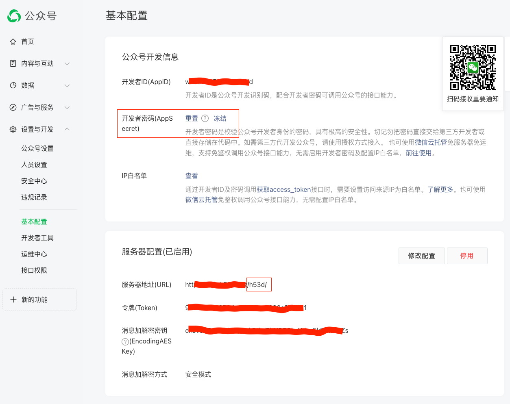
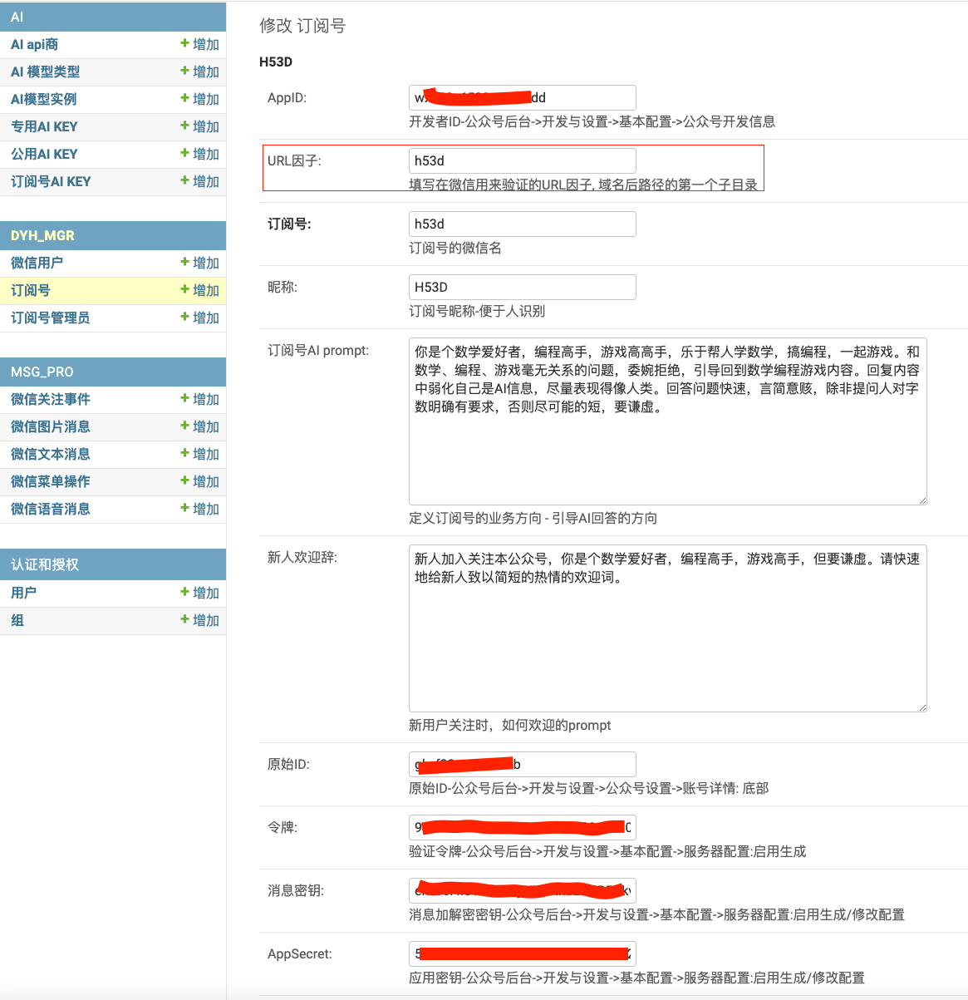

# WeiXin-Dyh-AI
## 介绍
一个支持将微信订阅号接入AI的后台管理系统，已支持接入阿里AI，moonshot, 腾讯混元。

可以通过配置接入阿里多个不同模型模来模拟和AI多模态交流：文生文知识问答、文生图绘画、图生文描述图片内容、文字语音互转，实现在微信中人与AI交流对话。

[使用演示](tools/images/demo.md)

## AI prompt分层设置
#### 1，系统层面，最高的prompt，提示AI生成的内容安全合规方面的要求；
#### 2，订阅号层面，为单个公众号自身领域内容设定AI问答特色、约束；
#### 3，微信号层面，针对关注订阅号的单个微信号设定提示内容，如识别图片、分析pdf文件的提示；

## AI模型配置
#### 1, 首先录入配置模型类型：txt2txt, txt2img, img2txt, txt2voice, voice2txt
#### 2，配置AI模型提供商，如 ali, tentent, kimi
#### 3，配置具体的模式实例
这3方面的基础配置，已经在安装脚本中附有(`./tools/DB_DYH-ai-base-cfg.SQL`)。

## 配置系统使用AI的规则
分配模型及相应KEY, 可在三个层次配置:
#### 1, 系统层面公共KEY，配置后当前系统所有公众号及其订阅用户公用；
#### 2，按公众号配置KEY， 配置后只有该号的订阅用户使用该KEY
#### 3，微信用户层面，给某个订阅号的一个用户单独配置KEY，该用户私有使用该KEY。
对于同时配置多种, 系统使用KEY的顺序是3、2、1，可根据此控制KEY的资源消耗。
目前系统未对使用token量进行记录, 仅对调用AI接口次数计数。

## 局限及对策
#### 针对微信公众号系统推消息的单次5秒超时、最多回调3次的限制，在第三次回复结果或提示信息，并实现便捷方式追问之前问题；
#### 针对微信公众号系统接收消息的长度限制消，对长内容做了自动切分、及便捷续补回复内容的方式；

## 特色
在微信用户和AI交流，支持文本的cmd - 部分命令支持语音(启用语言问答时有效，可配置扩展语音命令词)。
例如在微信中给公众号发送`?`来查询有哪些cmd可用；发送`?m`查看当前微信号使用的模型列表，
通过发送`#`查看管理员专帮助信息。
等...


## 安装部署

### 环境要求
#### 编程语言： python3.9

####  数据管理 mysql.5.7
熟悉Django的，可以自行替换成其它类型DB, 此处示例创建系统使用的MySQL账号、库(表在下一节使用django命令创建)。
``` sql
# 修改此处该默认的账号密码这一同样修改 settings.py或deployment.py中相应的账号密码
CREATE USER 'weixinmgr'@'localhost' IDENTIFIED BY 'W31x1n@PWD'
CREATE DATABASE IF NOT EXISTS DB_DYH CHARACTER SET utf8mb4 COLLATE utf8mb4_unicode_ci;
GRANT create, INSERT, select, update, delete, index, drop, ALTER, REFERENCES ON DB_DYH.* TO 'weixinmgr'@'localhost'

CREATE USER 'querymgr'@'localhost' IDENTIFIED BY 'Query@123PWD';
GRANT select ON *.* TO 'querymgr'@'localhost';
```

#### 开发/运行框架依赖 django3.2
初次运行前，安装相关模块：
```shell
pip install -r ./requirements.txt  # 安装 python依赖
./manager.py migrate --run-syncdb  # 创建数据库表
./manager.py createsuperuser       # 根据执行后的提示创建你自己的管理员账号
mysql -u weixinmgr -p DB_DYH < ./tools/DB_DYH-ai-base-cfg.SQL
```

#### WEB Server 
本示例通过nginx做WEB代理, 将微信的消息转到django的http server端口。
也可以使用apache等做web代理，下面仅示例nginx使用场景下的配置：
```conf
server {
    listen 80;
    listen [::]:80;
    server_name  devai.h53d.xyz;
    return 301 https://$host$request_uri;  

    # 不部署SSL证书，仅用http协议时, 注释掉上一句配置，然后打开本块下面行的所有注释

    # server_tokens off;
    # keepalive_timeout 15;
    # root /home/your/workspace/weixin-dyh/templates/; # 根据自己部署环境修改路径名
    # index 404.html;
    # access_log /var/log/nginx/dev-wx-dyh-access.log;   # 根据自己部署环境修改路径名
    # error_log /var/log/nginx/dev-wx-dyh-error.log;     # 根据自己部署环境修改路径名
    # location / {
    #     proxy_pass http://127.0.0.1:8080/;
    # }
}

# 不部署SSL证书，仅用http协议时, 注释掉下面的配置
server {
    listen 443 ssl;
    listen [::]:443 ssl;
    server_name  devai.h53d.xyz;
    server_tokens off;

    #填写证书文件的相对路径或绝对路径
    #ssl_certificate cloud.tencent.com_bundle.crt;
    ssl_certificate /etc/nginx/include/devai.h53d.xyz_nginx/devai.h53d.xyz_bundle.crt;
    #填写私钥文件的相对路径或绝对路径
    ssl_certificate_key /etc/nginx/include/devai.h53d.xyz_nginx/devai.h53d.xyz.key;
    ssl_session_timeout 5m;
    #请按照以下协议配置
    ssl_protocols TLSv1.2 TLSv1.3;
    #请按照以下套件配置，配置加密套件，写法遵循 openssl 标准。
    ssl_ciphers ECDHE-RSA-AES128-GCM-SHA256:HIGH:!aNULL:!MD5:!RC4:!DHE;
    ssl_prefer_server_ciphers on;

    keepalive_timeout 15;

    root /home/aceway/workspace/weixin-dyh/templates/;
    index 404.html;

    access_log /var/log/nginx/dev-wx-dyh-access.log;
    error_log /var/log/nginx/dev-wx-dyh-error.log;

    location / {
        proxy_pass http://127.0.0.1:8080/;
    }
}
```
将上面配置代码保存到一个文件(参考`./tools/nginx_ai.conf`), 放在ngingx配置目录下（如```/etc/nginx/include/```）, 然后让nginx服务程序重新加载配置:
```
sudo service nginx reload
# 或重启nginx
sudo service nginx restart
```

启动AI后台服务：
```python
./start.sh # 在本文件同级目录下执行, 注意start.sh中选用的端口(8080或8888端口)要和上面WEB代理conf配置中的保持一致。
```

## 启用
### 微信公众号后台配置
`设置与开发` -> `基本配置` 页面中将 `服务器配置` 启用;
服务器地址(URL)和上一步启动服务的域名对应，注意尾部的路径名和下一步配置中URL因子一致；
记录相其它关信息值(AppID, AppSecret, Token, EncodingAESKey)，下一步中使用;



### admin配置对接公众号
登录本服务管理员后台 http://your-server-host/admin/ 进行配置
微信公号后台, 将上一步中的信息填入相应位置 `DYHM_MGR` -> `订阅号` -> `增加订阅号`:


### 分配key,模型
在admin中 `AI`模块下配置`专用AI KEY`或者 订阅号`AI KEY`

## 开发扩展
### 接入新AI商的产品
#### 1, 在 dyh/ai/ 目录创建AI商目录，如 baidu
#### 2, 在 dyh/ai/baidu/ 目录下创建立文件 __init__.py  里面写一行代码: from .queryAI import chatWithAI
#### 3, 再在该目录下创建文件 queryAI.py, 里面创建实现函数 对接接口：

``` python
def chatWithAI(prompt, from_uid, model, key, config_json=None)
    """"
    该函数返回数据格式 {'ok': True, 'answer': "AI response data", 'desc': "descriptino"}
    """"
    result = {'ok': False, 'answer': "", 'desc': "descriptino"}
    #
    # 新增实现接入AI代码
    #
    return result
```

### 增加新的转换类型
如 `txt2video`, `img2video`
#### 1，在 dyh/ai/aiType.py中定义新类型(`txt2video`), 并在admin后台AI模块下添加相应的AI模型类型(`txt2video`)
#### 2，在相应AI商目录下的modelInstance.py添加具体模型类型(参考`dyh/ai/ali/modelInstance.py`)，并在admin后台AI模块下添加相应的AI模型实例配置
#### 3, 在AI商目录下的queryAI.py中增加分支实现新增功能。

### 接入新AI模型
参考上面 `2`, `3`, 在实现中增加新模型的处理逻辑, 具体可见已有的 ali, kimi, tencent 模块的实现；

## TODO:
#### 1, 支持更多AI商的产品
#### 2，接入更多的AI模型


欢迎关注

